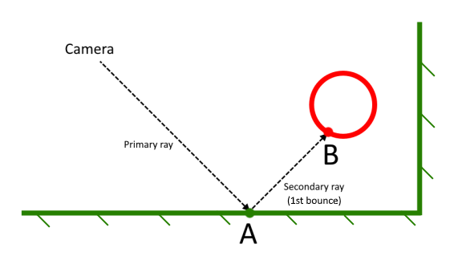
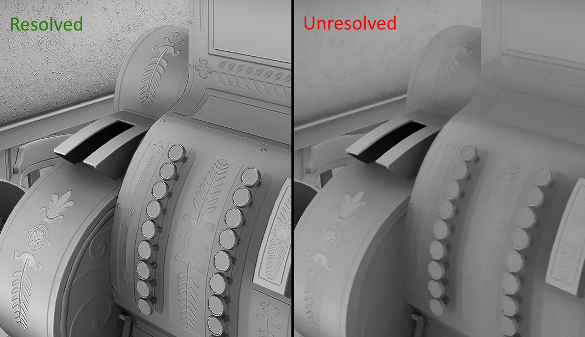
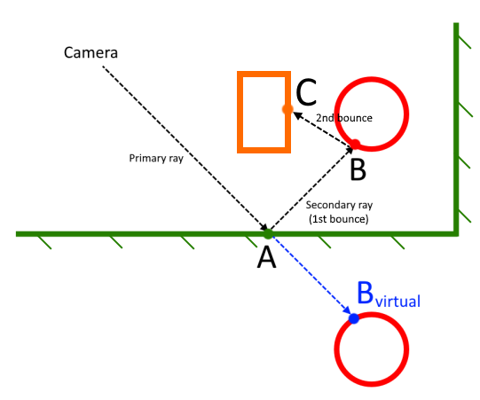

# NVIDIA REAL-TIME DENOISERS v4.4.2 (NRD)

[](https://github.com/NVIDIAGameWorks/RayTracingDenoiser/actions/workflows/build.yml)


For quick starting see *[NRD sample](https://github.com/NVIDIAGameWorks/NRDSample)* project.

# OVERVIEW

*NVIDIA Real-Time Denoisers (NRD)* is a spatio-temporal API agnostic denoising library. The library has been designed to work with low rpp (ray per pixel) signals. *NRD* is a fast solution that slightly depends on input signals and environment conditions.

*NRD* includes the following denoisers:
- *REBLUR* - recurrent blur based denoiser
- *RELAX* - A-trous based denoiser, has been designed for *[RTXDI (RTX Direct Illumination)](https://developer.nvidia.com/rtxdi)*
- *SIGMA* - shadow-only denoiser

Performance on RTX 4080 @ 1440p (native resolution, default denoiser settings):
- `REBLUR_DIFFUSE_SPECULAR` - 2.45 ms
- `RELAX_DIFFUSE_SPECULAR` - 2.90 ms
- `SIGMA_DIFFUSE_SPECULAR` - 0.30 ms

Supported signal types:
- *RELAX*:
  - Diffuse & specular radiance
- *REBLUR*:
  - Diffuse & specular radiance
  - Diffuse (ambient) & specular occlusion (OCCLUSION variants)
  - Diffuse (ambient) directional occlusion (DIRECTIONAL_OCCLUSION variant)
  - Diffuse & specular radiance in spherical harmonics (spherical gaussians) (SH variants)
- *SIGMA*:
  - Shadows from an infinite light source (sun, moon)
  - Shadows from a local light source (omni, spot)

For diffuse and specular signals de-modulated irradiance (i.e. irradiance with "removed" materials) can be used instead of radiance (see "Recommendations and Best Practices" section).

*NRD* is distributed as a source as well with a “ready-to-use” library (if used in a precompiled form). It can be integrated into any DX12, VULKAN or DX11 engine using two variants:
1. Native implementation of the *NRD* API using engine capabilities
2. Integration via an abstraction layer. In this case, the engine should expose native Graphics API pointers for certain types of objects. The integration layer, provided as a part of SDK, can be used to simplify this kind of integration.

# HOW TO BUILD?

- Install [*Cmake*](https://cmake.org/download/) 3.15+
- Install on
    - Windows: latest *WindowsSDK* and *VulkanSDK*
    - Linux (x86-64): latest *VulkanSDK*
    - Linux (aarch64): find a precompiled binary for [*DXC*](https://github.com/microsoft/DirectXShaderCompiler) or disable shader compilation `NRD_EMBEDS_SPIRV_SHADERS=OFF`
- Build (variant 1) - using *Git* and *CMake* explicitly
    - Clone project and init submodules
    - Generate and build the project using *CMake*
- Build (variant 2) - by running scripts:
    - Run `1-Deploy`
    - Run `2-Build`

CMake options:
- `NRD_SHADERS_PATH` - shader output path override
- `NRD_STATIC_LIBRARY` - build static library (OFF by default)
- `NRD_DXC_CUSTOM_PATH` - custom DXC to use if Vulkan SDK is not installed
- `NRD_NORMAL_ENCODING` - *normal* encoding for the entire library
- `NRD_ROUGHNESS_ENCODING` - *roughness* encoding for the entire library
- `NRD_EMBEDS_DXBC_SHADERS` - NRD compiles and embeds DXBC shaders (ON by default on Windows)
- `NRD_EMBEDS_DXIL_SHADERS` - NRD compiles and embeds DXIL shaders (ON by default on Windows)
- `NRD_EMBEDS_SPIRV_SHADERS` - NRD compiles and embeds SPIRV shaders (ON by default)
- `NRD_DISABLE_SHADER_COMPILATION` - disable shader compilation on the NRD side, NRD assumes that shaders are already compiled externally and have been put into `NRD_SHADERS_PATH` folder

`NRD_NORMAL_ENCODING` and `NRD_ROUGHNESS_ENCODING` can be defined only *once* during project deployment. These settings are dumped in `NRDEncoding.hlsli` file, which needs to be included on the application side prior `NRD.hlsli` inclusion to deliver encoding settings matching *NRD* settings. `LibraryDesc` includes encoding settings too. It can be used to verify that the library meets the application expectations.

Tested platforms:

| OS                | Architectures  | Compilers   |
|-------------------|----------------|-------------|
| Windows           | AMD64          | MSVC, Clang |
| Linux             | AMD64, ARM64   | GCC, Clang  |

SDK packaging:
- Compile the solution (*Debug* / *Release* or both, depending on what you want to get in *NRD* package)
- Run `3-Prepare NRD SDK`
- Grab generated in the root directory `_NRD_SDK` and `_NRI_SDK` (if needed) folders and use them in your project

# HOW TO UPDATE?

- Clone latest with all dependencies
- Run `4-Clean.bat`
- Run `1-Deploy`
- Run `2-Build`

# HOW TO REPORT ISSUES?

NRD sample has *TESTS* section in the bottom of the UI, a new test can be added if needed. The following procedure is recommended:
- Try to reproduce a problem in the *NRD sample* first
  - if reproducible
    - add a test (by pressing `Add` button)
    - describe the issue and steps to reproduce on *GitHub*
    - attach depending on the selected scene `.bin` file from the `Tests` folder
  - if not
    - verify the integration
- If nothing helps
  - describe the issue, attach a video and steps to reproduce

Additionally, for any information, suggestions or general requests please feel free to contact us at NRD-SDK-Support@nvidia.com

# API

Terminology:
* *Denoiser* - a denoiser to use (for example: `Denoiser::REBLUR_DIFFUSE`)
* *Instance* - a set of denoisers aggregated into a monolithic entity (the library is free to rearrange passes without dependencies). Each denoiser in the instance has an associated *Identifier*
* *Resource* - an input, output or internal resource (currently can only be a texture)
* *Texture pool (or pool)* - a texture pool that stores permanent or transient resources needed for denoising. Textures from the permanent pool are dedicated to *NRD* and can not be reused by the application (history buffers are stored here). Textures from the transient pool can be reused by the application right after denoising. *NRD* doesn’t allocate anything. *NRD* provides resource descriptions, but resource creations are done on the application side.

Flow:
1. *GetLibraryDesc* - contains general *NRD* library information (supported denoisers, SPIRV binding offsets). This call can be skipped if this information is known in advance (for example, is diffuse denoiser available?), but it can’t be skipped if SPIRV binding offsets are needed for VULKAN
2. *CreateInstance* - creates an instance for requested denoisers
3. *GetInstanceDesc* - returns descriptions for pipelines, samplers, texture pools, constant buffer and descriptor set. All this stuff is needed during the initialization step
4. *SetCommonSettings* - sets common (shared) per frame parameters
5. *SetDenoiserSettings* - can be called to change parameters dynamically before applying the denoiser on each new frame / denoiser call
6. *GetComputeDispatches* - returns per-dispatch data for the list of denoisers (bound subresources with required state, constant buffer data). Returned memory is owned by the instance and gets overwritten by the next *GetComputeDispatches* call
7. *DestroyInstance* - destroys an instance

*NRD* doesn't make any graphics API calls. The application is supposed to invoke a set of compute *Dispatch* calls to actually denoise input signals. Please, refer to `NrdIntegration::Denoise()` and `NrdIntegration::Dispatch()` calls in `NRDIntegration.hpp` file as an example of an integration using low level RHI.

*NRD* doesn’t have a "resize" functionality. On resolution change the old denoiser needs to be destroyed and a new one needs to be created with new parameters. But *NRD* supports dynamic resolution scaling via `CommonSettings::resolutionScale`.

Some textures can be requested as inputs or outputs for a method (see the next section). Required resources are specified near a denoiser declaration inside the `Denoiser` enum class. Also `NRD.hlsli` has a comment near each front-end or back-end function, clarifying which resources this function is for.

# NON-NOISY INPUTS

Commons inputs for primary hits (if *PSR* is not used, common use case) or for secondary hits (if *PSR* is used, valid only for 0-roughness):

* **IN\_MV** - non-jittered surface motion (`old = new + MV`)

  Modes:
  - *2D screen-space motion* - 2D motion doesn't provide information about movement along the view direction. *NRD* can reject history on dynamic objects in this case
  - *2.5D screen-space motion (recommended)* - similar to the 2D screen-space motion, but `.z = viewZprev - viewZ`
  - *3D world-space motion* - camera motion should not be included (it's already in the matrices). In other words, if there are no moving objects, all motion vectors must be `0` even if the camera is moving

  Motion vector scaling can be provided via `CommonSettings::motionVectorScale`. *NRD* expectations:
  - Use `CommonSettings::isMotionVectorInWorldSpace = true` for 3D world-space motion
  - Use `CommonSettings::isMotionVectorInWorldSpace = false` and `CommonSettings::motionVectorScale[2] == 0` for 2D screen-space motion
  - Use `CommonSettings::isMotionVectorInWorldSpace = false` and `CommonSettings::motionVectorScale[2] != 0` for 2.5D screen-space motion

* **IN\_NORMAL\_ROUGHNESS** - surface world-space normal and *linear* roughness

  Normal and roughness encoding must be controlled via *Cmake* parameters `NRD_NORMAL_ENCODING` and `NRD_ROUGHNESS_ENCODING`. Optional `NRDEncoding.hlsli` file is generated during project deployment, which can be included prior `NRD.hlsli` to make encoding macro definitions visible in shaders (if `NRD_NORMAL_ENCODING` and `NRD_ROUGHNESS_ENCODING` are not defined in another way by the application). Encoding settings can be known at runtime by accessing `GetLibraryDesc().normalEncoding` and `GetLibraryDesc().roghnessEncoding` respectively. `NormalEncoding` and `RoughnessEncoding` enums briefly describe encoding variants. It's recommended to use `NRD_FrontEnd_PackNormalAndRoughness` from `NRD.hlsli` to match decoding.

  *NRD* computes local curvature using provided normals. Less accurate normals can lead to banding in curvature and local flatness. `RGBA8` normals is a good baseline, but `R10G10B10A10` oct-packed normals improve curvature calculations and specular tracking as the result.

  If `materialID` is provided and supported by encoding, *NRD* diffuse and specular denoisers won't mix up surfaces with different material IDs.

* **IN\_VIEWZ** - `.x` - view-space Z coordinate of primary hits (linearized g-buffer depth)

  Positive and negative values are supported. Z values in all pixels must be in the same space, matching space defined by matrices passed to NRD. If, for example, the protagonist's hands are rendered using special matrices, Z values should be computed as:
  - reconstruct world position using special matrices for "hands"
  - project on screen using matrices passed to NRD
  - `.w` component is positive view Z (or just transform world-space position to main view space and take `.z` component)

All textures should be *NaN* free at each pixel, even at pixels outside of denoising range.

The illustration below shows expected inputs for primary hits:



```cpp
hitDistance = length( B - A ); // hitT for 1st bounce (recommended baseline)

IN_VIEWZ = TransformToViewSpace( A ).z;
IN_NORMAL_ROUGHNESS = GetNormalAndRoughnessAt( A );
IN_MV = GetMotionAt( A );
```

See `NRDDescs.h` for more details and descriptions of other inputs and outputs.

# NOISY INPUTS

NRD sample is a good start to familiarize yourself with input requirements and best practices, but main requirements can be summarized to:

- Since *NRD* denoisers accumulate signals for a limited number of frames, the input signal must converge *reasonably* well for this number of frames. `REFERENCE` denoiser can be used to estimate temporal signal quality
- Since *NRD* denoisers process signals spatially, high-energy fireflies in the input signal should be avoided. Most of them can be removed by enabling anti-firefly filter in *NRD*, but it will only work if the "background" signal is confident. The worst case is having a single pixel with high energy divided by a very small PDF to represent the lack of energy in neighboring non-representative (black) pixels
- Radiance must be separated into diffuse and specular at primary hit (or secondary hit in case of *PSR*)
- `hitT` can't be negative
- `hitT` must not include primary hit distance
- `hitT` for the first bounce after the primary hit or *PSR* must be provided "as is"
- `hitT` for subsequent bounces and for bounces before *PSR* must be adjusted by curvature and lobe energy dissipation on the application side
  - Do not pass *sum of lengths of all segments* as `hitT`. A solid baseline is to use hit distance for the 1st bounce only, it works well for diffuse and specular signals
  - *NRD sample* uses more complex approach for accumulating `hitT` along the path, which takes into account energy dissipation due to lobe spread and curvature at the current hit
- For rays pointing inside the surface (VNDF sampling can easily produce those), `hitT` must be set to 0 (but better to not cast such rays)
- Noise in hit distances must follow a diffuse or specular lobe. It implies that `hitT` for `roughness = 0` must be clean (if probabilistic sampling is not in use)
- In case of probabilistic diffuse / specular selection at the primary hit, provided `hitT` must follow the following rules:
  - Should not be divided by `PDF`
  - If diffuse or specular sampling is skipped, `hitT` must be set to `0` for corresponding signal type
  - `hitDistanceReconstructionMode` must be set to something other than `OFF`, but bear in mind that the search area is limited to 3x3 or 5x5. In other words, it's the application's responsibility to guarantee a valid sample in this area. It can be achieved by clamping probabilities and using Bayer-like dithering (see the sample for more details)
  - Pre-pass must be enabled (i.e. `diffusePrepassBlurRadius` and `specularPrepassBlurRadius` must be set to 20-70 pixels) to compensate entropy increase, since radiance in valid samples is divided by probability to compensate 0 values in some neighbors
- Probabilistic sampling for 2nd+ bounces is absolutely acceptable

See `NRDDescs.h` for more details and descriptions of other inputs and outputs.

# IMPROVING OUTPUT QUALITY

The temporal part of *NRD* naturally suppresses jitter, which is essential for upscaling techniques. If an *SH* denoiser is in use, a high quality resolve can be applied to the final output to regain back macro details, micro details and per-pixel jittering. As an example, the image below demonstrates the results *after* and *before* resolve with active *DLSS* (quality mode).



The resolve process takes place on the application side and has the following modular structure:
- construct an SG (spherical gaussian) light
- apply diffuse or specular resolve function to reconstruct macro details
- apply re-jittering to reconstruct micro details
- (optionally) or just extract unresolved color (fully matches the output of a corresponding non-SH denoiser)

Shader code:
```cpp
// Diffuse
float4 diff = gIn_Diff.SampleLevel( gLinearSampler, pixelUv, 0 );
float4 diff1 = gIn_DiffSh.SampleLevel( gLinearSampler, pixelUv, 0 );
NRD_SG diffSg = REBLUR_BackEnd_UnpackSh( diff, diff1 );

// Specular
float4 spec = gIn_Spec.SampleLevel( gLinearSampler, pixelUv, 0 );
float4 spec1 = gIn_SpecSh.SampleLevel( gLinearSampler, pixelUv, 0 );
NRD_SG specSg = REBLUR_BackEnd_UnpackSh( spec, spec1 );

// ( Optional ) AO / SO ( available only for REBLUR )
diff.w = diffSg.normHitDist;
spec.w = specSg.normHitDist;

if( gResolve )
{
    // ( Optional ) replace "roughness" with "roughnessAA"
    roughness = NRD_SG_ExtractRoughnessAA( specSg );

    // Regain macro-details
    diff.xyz = NRD_SG_ResolveDiffuse( diffSg, N ); // or NRD_SH_ResolveDiffuse( sg, N )
    spec.xyz = NRD_SG_ResolveSpecular( specSg, N, V, roughness );

    // Regain micro-details & jittering // TODO: preload N and Z into SMEM
    float3 Ne = NRD_FrontEnd_UnpackNormalAndRoughness( gIn_Normal_Roughness[ pixelPos + int2( 1, 0 ) ] ).xyz;
    float3 Nw = NRD_FrontEnd_UnpackNormalAndRoughness( gIn_Normal_Roughness[ pixelPos + int2( -1, 0 ) ] ).xyz;
    float3 Nn = NRD_FrontEnd_UnpackNormalAndRoughness( gIn_Normal_Roughness[ pixelPos + int2( 0, 1 ) ] ).xyz;
    float3 Ns = NRD_FrontEnd_UnpackNormalAndRoughness( gIn_Normal_Roughness[ pixelPos + int2( 0, -1 ) ] ).xyz;

    float Ze = gIn_ViewZ[ pixelPos + int2( 1, 0 ) ];
    float Zw = gIn_ViewZ[ pixelPos + int2( -1, 0 ) ];
    float Zn = gIn_ViewZ[ pixelPos + int2( 0, 1 ) ];
    float Zs = gIn_ViewZ[ pixelPos + int2( 0, -1 ) ];

    float2 scale = NRD_SG_ReJitter( diffSg, specSg, Rf0, V, roughness, viewZ, Ze, Zw, Zn, Zs, N, Ne, Nw, Nn, Ns );

    diff.xyz *= scale.x;
    spec.xyz *= scale.y;
}
else
{
    // ( Optional ) Unresolved color matching the non-SH version of the denoiser
    diff.xyz = NRD_SG_ExtractColor( diffSg );
    spec.xyz = NRD_SG_ExtractColor( specSg );
}
```

Re-jittering math with minorly modified inputs can also be used with RESTIR produced sampling without involving SH denoisers. You only need to get light direction in the current pixel from RESTIR. Despite that RESTIR produces noisy light selections, its low variations can be easily handled by DLSS or other upscaling techs.

# VALIDATION LAYER


If `CommonSettings::enableValidation = true` *REBLUR* & *RELAX* denoisers render debug information into `OUT_VALIDATION` output. Alpha channel contains layer transparency to allow easy mix with the final image on the application side. Currently the following viewport layout is used on the screen:

| 0 | 1 | 2 | 3 |
|---|---|---|---|
| 4 | 5 | 6 | 7 |
| 8 | 9 | 10| 11|
| 12| 13| 14| 15|

where:

- Viewport 0 - world-space normals
- Viewport 1 - linear roughness
- Viewport 2 - linear viewZ
  - green = `+`
  - blue = `-`
  - red = `out of denoising range`
- Viewport 3 - difference between MVs, coming from `IN_MV`, and expected MVs, assuming that the scene is static
  - blue = `out of screen`
  - pixels with moving objects have non-0 values
- Viewport 4 - world-space grid & camera jitter:
  - 1 cube = `1 unit`
  - the square in the bottom-right corner represents a pixel with accumulated samples
  - the red boundary of the square marks jittering outside of the pixel area

*REBLUR* specific:
- Viewport 7 - amount of virtual history
- Viewport 8 - number of accumulated frames for diffuse signal (red = `history reset`)
- Viewport 11 - number of accumulated frames for specular signal (red = `history reset`)
- Viewport 12 - input normalized `hitT` for diffuse signal (ambient occlusion, AO)
- Viewport 15 - input normalized `hitT` for specular signal (specular occlusion, SO)

# MEMORY REQUIREMENTS

The *Persistent* column (matches *NRD Permanent pool*) indicates how much of the *Working set* is required to be left intact for subsequent frames of the application. This memory stores the history resources consumed by NRD. The *Aliasable* column (matches *NRD Transient pool*) shows how much of the *Working set* may be aliased by textures or other resources used by the application outside of the operating boundaries of NRD.

| Resolution |                             Denoiser | Working set (Mb) |  Persistent (Mb) |   Aliasable (Mb) |
|------------|--------------------------------------|------------------|------------------|------------------|
|      1080p |                       REBLUR_DIFFUSE |            86.69 |            42.25 |            44.44 |
|            |             REBLUR_DIFFUSE_OCCLUSION |            42.44 |            25.38 |            17.06 |
|            |                    REBLUR_DIFFUSE_SH |           137.31 |            59.12 |            78.19 |
|            |                      REBLUR_SPECULAR |           105.75 |            50.75 |            55.00 |
|            |            REBLUR_SPECULAR_OCCLUSION |            50.94 |            33.88 |            17.06 |
|            |                   REBLUR_SPECULAR_SH |           156.38 |            67.62 |            88.75 |
|            |              REBLUR_DIFFUSE_SPECULAR |           169.06 |            71.88 |            97.19 |
|            |    REBLUR_DIFFUSE_SPECULAR_OCCLUSION |            72.12 |            38.12 |            34.00 |
|            |           REBLUR_DIFFUSE_SPECULAR_SH |           270.31 |           105.62 |           164.69 |
|            | REBLUR_DIFFUSE_DIRECTIONAL_OCCLUSION |            86.69 |            42.25 |            44.44 |
|            |                         SIGMA_SHADOW |            23.38 |             0.00 |            23.38 |
|            |            SIGMA_SHADOW_TRANSLUCENCY |            42.31 |             0.00 |            42.31 |
|            |                        RELAX_DIFFUSE |            99.25 |            63.31 |            35.94 |
|            |                     RELAX_DIFFUSE_SH |           158.31 |            88.62 |            69.69 |
|            |                       RELAX_SPECULAR |           101.44 |            63.38 |            38.06 |
|            |                    RELAX_SPECULAR_SH |           168.94 |            97.12 |            71.81 |
|            |               RELAX_DIFFUSE_SPECULAR |           168.94 |            97.12 |            71.81 |
|            |            RELAX_DIFFUSE_SPECULAR_SH |           303.94 |           164.62 |           139.31 |
|            |                            REFERENCE |            33.75 |            33.75 |             0.00 |
|            |                                      |                  |                  |                  |
|      1440p |                       REBLUR_DIFFUSE |           153.81 |            75.00 |            78.81 |
|            |             REBLUR_DIFFUSE_OCCLUSION |            75.06 |            45.00 |            30.06 |
|            |                    REBLUR_DIFFUSE_SH |           243.81 |           105.00 |           138.81 |
|            |                      REBLUR_SPECULAR |           187.56 |            90.00 |            97.56 |
|            |            REBLUR_SPECULAR_OCCLUSION |            90.06 |            60.00 |            30.06 |
|            |                   REBLUR_SPECULAR_SH |           277.56 |           120.00 |           157.56 |
|            |              REBLUR_DIFFUSE_SPECULAR |           300.06 |           127.50 |           172.56 |
|            |    REBLUR_DIFFUSE_SPECULAR_OCCLUSION |           127.56 |            67.50 |            60.06 |
|            |           REBLUR_DIFFUSE_SPECULAR_SH |           480.06 |           187.50 |           292.56 |
|            | REBLUR_DIFFUSE_DIRECTIONAL_OCCLUSION |           153.81 |            75.00 |            78.81 |
|            |                         SIGMA_SHADOW |            41.38 |             0.00 |            41.38 |
|            |            SIGMA_SHADOW_TRANSLUCENCY |            75.12 |             0.00 |            75.12 |
|            |                        RELAX_DIFFUSE |           176.31 |           112.50 |            63.81 |
|            |                     RELAX_DIFFUSE_SH |           281.31 |           157.50 |           123.81 |
|            |                       RELAX_SPECULAR |           180.06 |           112.50 |            67.56 |
|            |                    RELAX_SPECULAR_SH |           300.06 |           172.50 |           127.56 |
|            |               RELAX_DIFFUSE_SPECULAR |           300.06 |           172.50 |           127.56 |
|            |            RELAX_DIFFUSE_SPECULAR_SH |           540.06 |           292.50 |           247.56 |
|            |                            REFERENCE |            60.00 |            60.00 |             0.00 |
|            |                                      |                  |                  |                  |
|      2160p |                       REBLUR_DIFFUSE |           326.81 |           159.38 |           167.44 |
|            |             REBLUR_DIFFUSE_OCCLUSION |           159.44 |            95.62 |            63.81 |
|            |                    REBLUR_DIFFUSE_SH |           518.06 |           223.12 |           294.94 |
|            |                      REBLUR_SPECULAR |           398.50 |           191.25 |           207.25 |
|            |            REBLUR_SPECULAR_OCCLUSION |           191.31 |           127.50 |            63.81 |
|            |                   REBLUR_SPECULAR_SH |           589.75 |           255.00 |           334.75 |
|            |              REBLUR_DIFFUSE_SPECULAR |           637.56 |           270.94 |           366.62 |
|            |    REBLUR_DIFFUSE_SPECULAR_OCCLUSION |           271.00 |           143.44 |           127.56 |
|            |           REBLUR_DIFFUSE_SPECULAR_SH |          1020.06 |           398.44 |           621.62 |
|            | REBLUR_DIFFUSE_DIRECTIONAL_OCCLUSION |           326.81 |           159.38 |           167.44 |
|            |                         SIGMA_SHADOW |            88.06 |             0.00 |            88.06 |
|            |            SIGMA_SHADOW_TRANSLUCENCY |           159.69 |             0.00 |           159.69 |
|            |                        RELAX_DIFFUSE |           374.69 |           239.12 |           135.56 |
|            |                     RELAX_DIFFUSE_SH |           597.81 |           334.75 |           263.06 |
|            |                       RELAX_SPECULAR |           382.69 |           239.12 |           143.56 |
|            |                    RELAX_SPECULAR_SH |           637.69 |           366.62 |           271.06 |
|            |               RELAX_DIFFUSE_SPECULAR |           637.69 |           366.62 |           271.06 |
|            |            RELAX_DIFFUSE_SPECULAR_SH |          1147.69 |           621.62 |           526.06 |
|            |                            REFERENCE |           127.50 |           127.50 |             0.00 |

# INTEGRATION VARIANTS

## VARIANT 1: Black-box library (using the application-side Render Hardware Interface)

RHI must have the ability to do the following:
* Create shaders from precompiled binary blobs
* Create an SRV for a specific range of subresources
* Create and bind 4 predefined samplers
* Invoke a Dispatch call (no raster, no VS/PS)
* Create 2D textures with SRV / UAV access

## VARIANT 2: White-box library (using the application-side Render Hardware Interface)

Logically it's close to the Method 1, but the integration takes place in the full source code (only the *NRD* project is needed). In this case *NRD* shaders are handled by the application shader compilation pipeline. The application should still use *NRD* via *NRD API* to preserve forward compatibility. This variant suits best for compilation on other platforms (consoles, ARM), unlocks *NRD* modification on the application side and increases portability.

## VARIANT 3: Black-box library (using native API pointers)

If Graphics API's native pointers are retrievable from the RHI, the standard *NRD integration* layer can be used to greatly simplify the integration. In this case, the application should only wrap up native pointers for the *Device*, *CommandList* and some input / output *Resources* into entities, compatible with an API abstraction layer (*[NRI](https://github.com/NVIDIAGameWorks/NRI)*), and all work with *NRD* library will be hidden inside the integration layer:

*Engine or App → native objects → NRD integration layer → NRI → NRD*

*NRI = NVIDIA Rendering Interface* - an abstraction layer on top of Graphics APIs: DX11, DX12 and VULKAN. *NRI* has been designed to provide low overhead access to the Graphics APIs and simplify development of DX12 and VULKAN applications. *NRI* API has been influenced by VULKAN as the common denominator among these 3 APIs.

*NRI* and *NRD* are ready-to-use products. The application must expose native pointers only for Device, Resource and CommandList entities (no SRVs and UAVs - they are not needed, everything will be created internally). Native resource pointers are needed only for the denoiser inputs and outputs (all intermediate textures will be handled internally). Descriptor heap will be changed to an internal one, so the application needs to bind its original descriptor heap after invoking the denoiser.

In rare cases, when the integration via the engine’s RHI is not possible and the integration using native pointers is complicated, a "DoDenoising" call can be added explicitly to the application-side RHI. It helps to avoid increasing code entropy.

The pseudo code below demonstrates how *NRD integration* and *NRI* can be used to wrap native Graphics API pointers into NRI objects to establish connection between the application and NRD:

```cpp
//=======================================================================================================
// INITIALIZATION - DECLARATIONS
//=======================================================================================================

#include "NRIDescs.hpp"
#include "Extensions/NRIWrapperD3D12.h"
#include "Extensions/NRIHelper.h"

#include "NRD.h"
#include "NRDIntegration.hpp"

// bufferedFramesNum (usually 2-3 frames):
//      The application must provide number of buffered frames, it's needed to guarantee that
//      constant data and descriptor sets are not overwritten while being executed on the GPU.
// enableDescriptorCaching:
//      true - enables descriptor caching for the whole lifetime of an NrdIntegration instance
//      false - descriptors are cached only within a single "Denoise" call
NrdIntegration NRD = NrdIntegration(bufferedFramesNum, enableDescriptorCaching, "Name");

struct NriInterface
    : public nri::CoreInterface
    , public nri::HelperInterface
    , public nri::WrapperD3D12Interface
{};
NriInterface NRI;

//=======================================================================================================
// INITIALIZATION - WRAP NATIVE DEVICE
//=======================================================================================================

// Wrap the device
nri::DeviceCreationD3D12Desc deviceDesc = {};
deviceDesc.d3d12Device = ...;
deviceDesc.d3d12GraphicsQueue = ...;
deviceDesc.enableNRIValidation = false;

nri::Device* nriDevice = nullptr;
nri::Result nriResult = nri::nriCreateDeviceFromD3D12Device(deviceDesc, nriDevice);

// Get core functionality
nriResult = nri::nriGetInterface(*nriDevice,
  NRI_INTERFACE(nri::CoreInterface), (nri::CoreInterface*)&NRI);

nriResult = nri::nriGetInterface(*nriDevice,
  NRI_INTERFACE(nri::HelperInterface), (nri::HelperInterface*)&NRI);

// Get appropriate "wrapper" extension (XXX - can be D3D11, D3D12 or VULKAN)
nriResult = nri::nriGetInterface(*nriDevice,
  NRI_INTERFACE(nri::WrapperXXXInterface), (nri::WrapperXXXInterface*)&NRI);

//=======================================================================================================
// INITIALIZATION - INITIALIZE NRD
//=======================================================================================================

const nrd::DenoiserDesc denoiserDescs[] =
{
    // Put neeeded denoisers here, like:
    { identifier1, nrd::Denoiser::XXX },
    { identifier2, nrd::Denoiser::YYY },
};

nrd::InstanceCreationDesc instanceCreationDesc = {};
instanceCreationDesc.denoisers = denoiserDescs;
instanceCreationDesc.denoisersNum = GetCountOf(denoiserDescs);

// NRD itself is flexible and supports any kind of DRS, but NRD INTEGRATION pre-allocate resources with
// statically defines dimensions. DRS works only by adjusting the viewport: "CommonSettings::rectSize"
bool result = NRD.Initialize(resourceWidth, resourceHeight, instanceCreationDesc, *nriDevice, NRI, NRI);

//=======================================================================================================
// INITIALIZATION or RENDER - WRAP NATIVE POINTERS
//=======================================================================================================

// Wrap the command buffer
nri::CommandBufferD3D12Desc commandBufferDesc = {};
commandBufferDesc.d3d12CommandList = (ID3D12GraphicsCommandList*)d3d12CommandList;

// Not needed for NRD integration layer, but needed for NRI validation layer
commandBufferDesc.d3d12CommandAllocator = (ID3D12CommandAllocator*)d3d12CommandAllocatorOrJustNonNull;

nri::CommandBuffer* nriCommandBuffer = nullptr;
NRI.CreateCommandBufferD3D12(*nriDevice, commandBufferDesc, nriCommandBuffer);

// Wrap required textures (better do it only once on initialization)
nri::TextureTransitionBarrierDesc entryDescs[N] = {};
nri::Format entryFormat[N] = {};

for (uint32_t i = 0; i < N; i++)
{
    nri::TextureTransitionBarrierDesc& entryDesc = entryDescs[i];
    const MyResource& myResource = GetMyResource(i);

    nri::TextureD3D12Desc textureDesc = {};
    textureDesc.d3d12Resource = myResource->GetNativePointer();
    NRI.CreateTextureD3D12(*nriDevice, textureDesc, (nri::Texture*&)entryDesc.texture );

    // You need to specify the current state of the resource here, after denoising NRD can modify
    // this state. Application must continue state tracking from this point.
    // Useful information:
    //    SRV = nri::AccessBits::SHADER_RESOURCE, nri::TextureLayout::SHADER_RESOURCE
    //    UAV = nri::AccessBits::SHADER_RESOURCE_STORAGE, nri::TextureLayout::GENERAL
    entryDesc.nextAccess = ConvertResourceStateToAccessBits( myResource->GetCurrentState() );
    entryDesc.nextLayout = ConvertResourceStateToLayout( myResource->GetCurrentState() );
}

//=======================================================================================================
// RENDER - DENOISE
//=======================================================================================================

// Set common settings
//  - for the first time use defaults
//  - currently NRD supports only the following view space: X - right, Y - top, Z - forward or backward
nrd::CommonSettings commonSettings = {};
PopulateCommonSettings(commonSettings);

NRD.SetCommonSettings(commonSettings);

// Set settings for each method in the NRD instance
nrd::XxxSettings settings1 = {};
PopulateXxxSettings(settings1);

NRD.SetDenoiserSettings(identifier1, &settings1);

nrd::YyySettings settings2 = {};
PopulateYyySettings(settings2);

NRD.SetDenoiserSettings(identifier2, &settings2);

// Fill up the user pool
NrdUserPool userPool = {};
{
    // Fill only required "in-use" inputs and outputs in appropriate slots using entryDescs & entryFormat,
    // applying remapping if necessary. Unused slots will be {nullptr, nri::Format::UNKNOWN}
    NrdIntegration_SetResource(userPool, ...);
    ...
    NrdIntegration_SetResource(userPool, ...);
};

const nrd::Identifier denoisers[] = {identifier1, identifier2};
NRD.Denoise(denoisers, helper::GetCountOf(denoisers), *nriCommandBuffer, userPool);

// IMPORTANT: NRD integration binds own descriptor pool, don't forget to re-bind back your pool (heap)

//=======================================================================================================
// SHUTDOWN or RENDER - CLEANUP
//=======================================================================================================

// Better do it only once on shutdown
for (uint32_t i = 0; i < N; i++)
    NRI.DestroyTexture(entryDescs[i].texture);

NRI.DestroyCommandBuffer(*nriCommandBuffer);

//=======================================================================================================
// SHUTDOWN - DESTROY
//=======================================================================================================

// Release wrapped device
nri::nriDestroyDevice(*nriDevice);

// Also NRD needs to be recreated on "resize"
NRD.Destroy();
```

Shader part:

```cpp
#if 1
    #include "NRDEncoding.hlsli"
#else
    // Or define NRD encoding in Cmake and deliver macro definitions to shader compilation command line
#endif

#include "NRD.hlsli"

// Call corresponding "front end" function to encode data for NRD (NRD.hlsli indicates which function
// needs to be used for a specific input for a specific denoiser). For example:

float4 nrdIn = RELAX_FrontEnd_PackRadianceAndHitDist(radiance, hitDistance);

// Call corresponding "back end" function to decode data produced by NRD. For example:

float4 nrdOut = RELAX_BackEnd_UnpackRadiance(nrdOutEncoded);
```

# RECOMMENDATIONS AND BEST PRACTICES: GREATER TIPS

Denoising is not a panacea or miracle. Denoising works best with ray tracing results produced by a suitable form of importance sampling. Additionally, *NRD* has its own restrictions. The following suggestions should help to achieve best image quality:

## MATERIAL DE-MODULATION (IRRADIANCE → RADIANCE)

*NRD* has been designed to work with pure radiance coming from a particular direction. This means that data in the form "something / probability" should be avoided if possible because overall entropy of the input signal will be increased (but it doesn't mean that denoising won't work). Additionally, it means that materials needs to be decoupled from the input signal, i.e. *irradiance*, typically produced by a path tracer, needs to be transformed into *radiance*, i.e. BRDF should be applied **after** denoising. This is achieved by using "demodulation" trick:

    // Diffuse
    Denoising( diffuseRadiance * albedo ) → NRD( diffuseRadiance / albedo ) * albedo

    // Specular
    float3 preintegratedBRDF = PreintegratedBRDF( Rf0, N, V, roughness )
    Denoising( specularRadiance * BRDF ) → NRD( specularRadiance * BRDF / preintegratedBRDF ) * preintegratedBRDF

A good approximation for pre-integrated specular BRDF can be found *[here](https://github.com/NVIDIAGameWorks/Falcor/blob/056f7b7c73b69fa8140d211bbf683ddf297a2ae0/Source/Falcor/Rendering/Materials/Microfacet.slang#L213)*.

## COMBINED DENOISING OF DIRECT AND INDIRECT LIGHTING

1. For specular signal use indirect `hitT` for both direct and indirect lighting

The reason is that the denoiser uses `hitT` mostly for calculating motion vectors for reflections. For that purpose, the denoiser expects to see `hitT` from surfaces that are in the specular reflection lobe. When calculating direct lighting (NEE/RTXDI), we select a light per pixel, and the distance to that light becomes the `hitT` for both diffuse and specular channels. In many cases, the light is selected for a surface because of its diffuse contribution, not specular, which makes the specular channel contain the `hitT` of a diffuse light. That confuses the denoiser and breaks reprojection. On the other hand, the indirect specular `hitT` is always computed by tracing rays in the specular lobe.

2. For diffuse signal `hitT` can be further adjusted by mixing `hitT` from direct and indirect rays to get sharper shadows

Use first bounce hit distance for the indirect in the pseudo-code below:
```cpp
float hitDistContribution = directDiffuseLuminance / ( directDiffuseLuminance + indirectDiffuseLuminance + EPS );

float maxContribution = 0.5; // 0.65 works good as well
float directHitDistContribution = min(directHitDistContribution, maxContribution); // avoid over-sharpening

hitDist = lerp(indirectDiffuseHitDist, directDiffuseHitDist, directHitTContribution);
```

## INTERACTION WITH PRIMARY SURFACE REPLACEMENTS (PSR)

When denoising reflections in pure mirrors, some advantages can be reached if *NRD* "sees" the first "non-pure mirror" point after a series of pure mirror bounces (delta events). This point is called *Primary Surface Replacement*.

[*Primary Surface Replacement (PSR)*](https://developer.nvidia.com/blog/rendering-perfect-reflections-and-refractions-in-path-traced-games/) can be used with *NRD*.

Notes, requirements and restrictions:
- the primary hit (0th bounce) gets replaced with the first "non-pure mirror" hit in the bounce chain - this hit becomes *PSR*
- all associated data in the g-buffer gets replaced by *PSR* data
- the camera "sees" PSRs like the mirror surfaces in-between don't exist. This space is called virtual world space
  - virtual space position lies on the same view vector as the primary hit position, but the position is elongated. Elongation depends on `hitT` and curvature at bounces, starting from the primary hit
  - virtual space normal is the normal at *PSR* hit mirrored several times  in the reversed order until the primary hit is reached
- *PSR* data is NOT always data at the *PSR* hit!
  - material properties (albedo, metalness, roughness etc.) are from *PSR* hit
  - `IN_VIEWZ` contains `viewZ` of the virtual position
  - `IN_MV` contains motion of the virtual position
  - `IN_NORMAL_ROUGHNESS` contains normal at virtual world space and roughness at *PSR*
  - accumulated `hitT` for *NRD* starts at the *PSR* hit. Curvature must be taken into account on the application side only for 2nd+ bounces starting from this hit (similarly to `hitT` requirements in *Noisy Inputs* section)
  - ray direction for *NRD* must be transformed into virtual space

In case of *PSR* *NRD* disocclusion logic doesn't take curvature at primary hit into account, because data for primary hits is replaced. This can lead to more intense disocclusions on bumpy surfaces due to significant ray divergence. To mitigate this problem 2x-10x larger `disocclusionThreshold` can be used. This is an applicable solution if the denoiser is used to denoise surfaces with *PSR* only (glass only, for example). In a general case, when *PSR* and normal surfaces are mixed on the screen, higher disocclusion thresholds are needed only for pixels with *PSR*. This can be achieved by using `IN_DISOCCLUSION_THRESHOLD_MIX` input to smoothly mix baseline `disocclusionThreshold` into bigger `disocclusionThresholdAlternate` from `CommonSettings`. Most likely the increased disocclusion threshold is needed only for pixels with normal details at primary hits (local curvature is not zero).

The illustration below shows expected inputs for secondary hits:



```cpp
hitDistance = length( C - B ); // hitT for 2nd bounce, but it's 1st bounce in the reflected world
Bvirtual = A + viewVector * length( B - A );

IN_VIEWZ = TransformToViewSpace( Bvirtual ).z;
IN_NORMAL_ROUGHNESS = GetVirtualSpaceNormalAndRoughnessAt( B );
IN_MV = GetMotionAt( B );
```

## INTERACTION WITH `INFs` AND `NANs`

- NRD doesn't touch pixels outside of viewport: `INFs / NANs` are allowed
- NRD doesn't touch pixels outside of denoising range: `INFs / NANs` are allowed
- `INFs / NANs` are not allowed for pixels inside the viewport and denoising range
  - `INFs` can be used in `IN_VIEWZ`, but not recommended

## INTERACTION WITH FRAME GENERATION TECHNIQUES

Frame generation (FG) techniques boost FPS by interpolating between 2 last available frames. *NRD* works better when framerate increases, because it gets more data per second. It's not the case for FG, because all rendering pipeline underlying passes (like, denoising) continue to work on the original non-boosted framerate.

# RECOMMENDATIONS AND BEST PRACTICES: LESSER TIPS

**[NRD]** The *NRD API* has been designed to support integration into native VULKAN apps. If the RHI you work with is DX11-like, not all provided data will be needed.

**[NRD]** Read all comments in `NRDDescs.h`, `NRDSettings.h` and `NRD.hlsli`.

**[NRD]** If you are unsure of which parameters to use - use defaults via `{}` construction. It helps to improve compatibility with future versions and offers optimal IQ, because default settings are always adjusted by recent algorithmic changes.

**[NRD]** *NRD* requires linear roughness and world-space normals. See `NRD.hlsli` for more details and supported customizations.

**[NRD]** *NRD* requires non-jittered matrices.

**[NRD]** Most of denoisers do not write into output pixels outside of `CommonSettings::denoisingRange`.

**[NRD]** When upgrading to the latest version keep an eye on `ResourceType` enumeration. The order of the input slots can be changed or something can be added, you need to adjust the inputs accordingly to match the mapping. Or use *NRD integration* to simplify the process.

**[NRD]** All pixels in floating point textures should be INF / NAN free to avoid propagation, because such values are used in weight calculations and accumulation of a weighted sum. Functions `XXX_FrontEnd_PackRadianceAndHitDist` perform optional NAN / INF clearing of the input signal. There is a boolean to skip these checks.

**[NRD]** All denoisers work with positive RGB inputs (some denoisers can change color space in *front end* functions). For better image quality, HDR color inputs need to be in a sane range [0; 250], because the internal pipeline uses FP16 and *RELAX* tracks second moments of the input signal, i.e. `x^2` must fit into FP16 range. If the color input is in a wider range, any form of non-aggressive color compression can be applied (linear scaling, pow-based or log-based methods). *REBLUR* supports wider HDR ranges, because it doesn't track second moments. Passing pre-exposured colors (i.e. `color * exposure`) is not recommended, because a significant momentary change in exposure is hard to react to in this case.

**[NRD]** *NRD* can track camera motion internally. For the first time pass all MVs set to 0 (you can use `CommonSettings::motionVectorScale = {0}` for this) and set `CommonSettings::isMotionVectorInWorldSpace = true`, it will allow you to simplify the initial integration. Enable application-provided MVs after getting denoising working on static objects.

**[NRD]** Using 2D MVs can lead to massive history reset on moving objects, because 2D motion provides information only about pixel screen position but not about real 3D world position. Consider using 2.5D or 3D MVs instead. 2.5D motion, which is 2D motion with additionally provided `viewZ` delta (i.e. `viewZprev = viewZ + MV.z`), is even better, because it has the same benefits as 3D motion, but doesn't suffer from imprecision problems caused by world-space delta rounding to FP16 during MV patching on the NRD side.

**[NRD]** Firstly, try to get a working reprojection on a diffuse signal for camera rotations only (without camera motion).

**[NRD]** Diffuse and specular signals must be separated at primary hit (or at secondary hit in case of *PSR*).

**[NRD]** Denoising logic is driven by provided hit distances. For indirect lighting denoising passing hit distance for the 1st bounce only is a good baseline. For direct lighting a distance to an occluder or a light source is needed. Primary hit distance must be excluded in any case.

**[NRD]** Importance sampling is recommended to achieve good results in case of complex lighting environments. Consider using:
   - Cosine distribution for diffuse from non-local light sources
   - VNDF sampling for specular
   - Custom importance sampling for local light sources (*RTXDI*).

**[NRD]** Additionally the quality of the input signal can be increased by re-using already denoised information from the current or the previous frame.

**[NRD]** Hit distances should come from an importance sampling method. But if denoising of AO/SO is needed, AO/SO can come from cos-weighted (or VNDF) sampling in a tradeoff of IQ.

**[NRD]** Low discrepancy sampling (blue noise) helps to have more stable output in 0.5-1 rpp mode. It's a must for REBLUR-based Ambient and Specular Occlusion denoisers and SIGMA.

**[NRD]** It's recommended to set `CommonSettings::accumulationMode` to `RESET` for a single frame, if a history reset is needed. If history buffers are recreated or contain garbage, it's recommended to use `CLEAR_AND_RESET` for a single frame. `CLEAR_AND_RESET` is not free because clearing is done in a compute shader. Render target clears on the application side should be prioritized over this solution.

**[NRD]** If there are areas (besides sky), which don't require denoising (for example, casting a specular ray only if roughness is less than some threshold), providing `viewZ > CommonSettings::denoisingRange` in **IN\_VIEWZ** texture for such pixels will effectively skip denoising. Additionally, the data in such areas won't contribute to the final result.

**[NRD]** If there are areas (besides sky), which don't require denoising (for example, skipped diffuse rays for true metals). `materialID` and `materialMask` can be used to drive spatial passes.

**[NRD]** Input signal quality can be improved by enabling *pre-pass* via setting `diffusePrepassBlurRadius` and `specularPrepassBlurRadius` to a non-zero value. Pre-pass is needed more for specular and less for diffuse, because pre-pass outputs optimal hit distance for specular tracking (see the sample for more details).

**[NRD]** In case of probabilistic diffuse / specular split at the primary hit, hit distance reconstruction pass must be enabled, if exposed in the denoiser (see `HitDistanceReconstructionMode`).

**[NRD]** In case of probabilistic diffuse / specular split at the primary hit, pre-pass must be enabled, if exposed in the denoiser (see `diffusePrepassBlurRadius` and `specularPrepassBlurRadius`).

**[NRD]** Maximum number of accumulated frames can be FPS dependent. The following formula can be used on the application side to adjust `maxAccumulatedFrameNum`, `maxFastAccumulatedFrameNum` and potentially `historyFixFrameNum` too:
```
maxAccumulatedFrameNum = accumulationPeriodInSeconds * FPS
```

**[NRD]** Fast history is the input signal, accumulated for a few frames. Fast history helps to minimize lags in the main history, which is accumulated for more frames. The number of accumulated frames in the fast history needs to be carefully tuned to avoid introducing significant bias and dirt. Initial integration should be done with default settings. Bear in mind the following recommendation:
```
maxAccumulatedFrameNum > maxFastAccumulatedFrameNum > historyFixFrameNum
```

**[NRD]** In case of quarter resolution tracing and denoising use `pixelPos / 2` as texture coordinates. Using a "rotated grid" approach (when a pixel gets selected from 2x2 footprint one by one) is not recommended because it significantly bumps entropy of non-noisy inputs, leading to more disocclusions. In case of *REBLUR* it's recommended to increase `sigmaScale` in antilag settings. "Nearest Z" upsampling works best for upscaling of the denoised output. Code, as well as upsampling function, can be found in *NRD sample* releases before 3.10.

**[NRD]** *SH* denoisers can use more relaxed `lobeAngleFraction`. It can help to improve stability, while details will be reconstructed back by *SG* resolve.

**[REBLUR]** If more performance is needed, consider using `enablePerformanceMode = true`.

**[REBLUR]** *REBLUR* expects hit distances in a normalized form. To avoid mismatching, `REBLUR_FrontEnd_GetNormHitDist` must be used for normalization. Normalization parameters should be passed into *NRD* as `HitDistanceParameters` for internal hit distance denormalization. Some tweaking can be needed here, but in most cases default `HitDistanceParameters` works well. *REBLUR* outputs denoised normalized hit distance, which can be used by the application as ambient or specular occlusion (AO & SO) (see unpacking functions from `NRD.hlsli`).

**[REBLUR]** Intensity antilag parameters need to be carefully tuned. The defaults are good but `AntilagIntensitySettings::sensitivityToDarkness` needs to be tuned for a given HDR range. Initial integration should work with intensity antilag turned off.

**[REBLUR]** Even if antilag is off, it's recommended to tune `AntilagIntensitySettings::sensitivityToDarkness`, because it is used for error estimation.

**[RELAX]** *RELAX* works well with signals produced by *RTXDI* or very clean high RPP signals. The Sweet Home of *RELAX* is *RTXDI* sample. Please, consider getting familiar with this application.

**[SIGMA]** Using "blue" noise can help to avoid shadow shimmering, it works best if the pattern is static on the screen. Additionally, `blurRadiusScale` can be set to `2-4` to mitigate such problems in complicated cases.

**[SIGMA]** *SIGMA_TRANSLUCENT_SHADOW* can be used for shadow denoising from multiple light sources:

*L[i]* - unshadowed analytical lighting from a single light source (**not noisy**)<br/>
*S[i]* - stochastically sampled light visibility for *L[i]* (**noisy**)<br/>
*&Sigma;( L[i] )* - unshadowed analytical lighting, typically a result of tiled lighting (HDR, not in range [0; 1])<br/>
*&Sigma;( L[i] &times; S[i] )* - final lighting (what we need to get)

The idea:<br/>
*L1 &times; S1 + L2 &times; S2 + L3 &times; S3 = ( L1 + L2 + L3 ) &times; [ ( L1 &times; S1 + L2 &times; S2 + L3 &times; S3 ) / ( L1 + L2 + L3 ) ]*

Or:<br/>
*&Sigma;( L[i] &times; S[i] ) = &Sigma;( L[i] ) &times; [ &Sigma;( L[i] &times; S[i] ) / &Sigma;( L[i] ) ]*<br/>
*&Sigma;( L[i] &times; S[i] ) / &Sigma;( L[i] )* - normalized weighted sum, i.e. pseudo translucency (LDR, in range [0; 1])

Input data preparation example:
```cpp
float3 Lsum = 0;
float2x3 multiLightShadowData = SIGMA_FrontEnd_MultiLightStart( );

for( uint i = 0; i < N; i++ )
{
    float3 L = ComputeLighting( i );
    Lsum += L;

    // "distanceToOccluder" should respect rules described in NRD.hlsli in "INPUT PARAMETERS" section
    float distanceToOccluder = SampleShadow( i );

    // The weight should be zero if a pixel is not in the penumbra, but it is not trivial to compute...
    float weight = ...;

    SIGMA_FrontEnd_MultiLightUpdate( L, distanceToOccluder, tanOfLightAngularRadius, weight, multiLightShadowData );
}

float4 shadowTranslucency;
float2 shadowData = SIGMA_FrontEnd_MultiLightEnd( viewZ, multiLightShadowData, Lsum, shadowTranslucency );
```

After denoising the final result can be computed as:

*&Sigma;( L[i] &times; S[i] )* = *&Sigma;( L[i] )* &times; *OUT_SHADOW_TRANSLUCENCY.yzw*

Is this a biased solution? If spatial filtering is off - no, because we just reorganized the math equation. If spatial filtering is on - yes, because denoising will be driven by most important light in a given pixel.

**This solution is limited** and hard to use:
- obviously, can be used "as is" if shadows don't overlap (*weight* = 1)
- if shadows overlap, a separate pass is needed to analyze noisy input and classify pixels as *umbra* - *penumbra* (and optionally *empty space*). Raster shadow maps can be used for this if available
- it is not recommended to mix 1 cd and 100000 cd lights, since FP32 texture will be needed for a weighted sum.
In this case, it's better to process the sun and other bright light sources separately.
